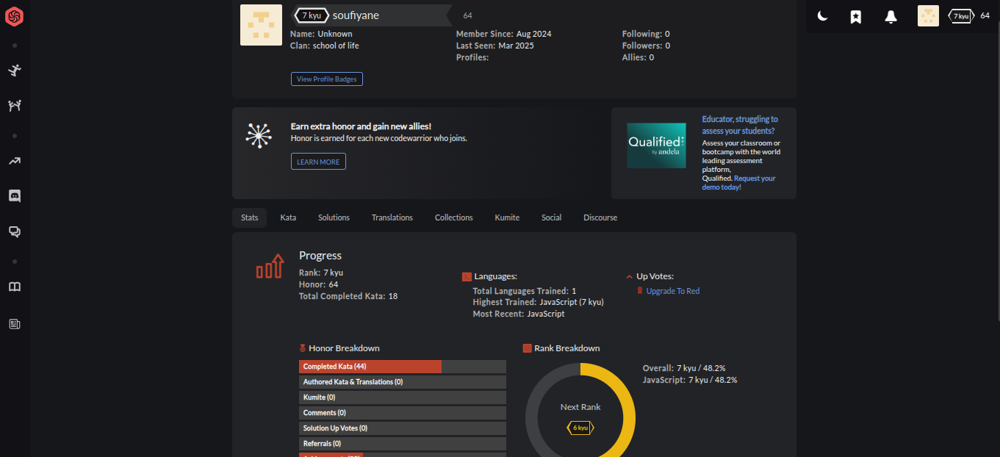

## codeWars Challenges: [visit Here](https://www.codewars.com/users/soufiyane%20)

A repository filled with codewars challenges (kata), I push 5 solutions every week.

## How It's Made:

**Tech used**: 

  

Everyday, the first thing I do is solve a Codewar!

## Optimizations

I consistently refactor and optimize my code, sometimes for efficiency, sometimes for readability.

## Lessons Learned:

The Biggest Lesson I learned in tackling this endless supply of questions is understanding that there is a long way to go. Not being able to answer a question is okay, as long as you take initiative to improve.
